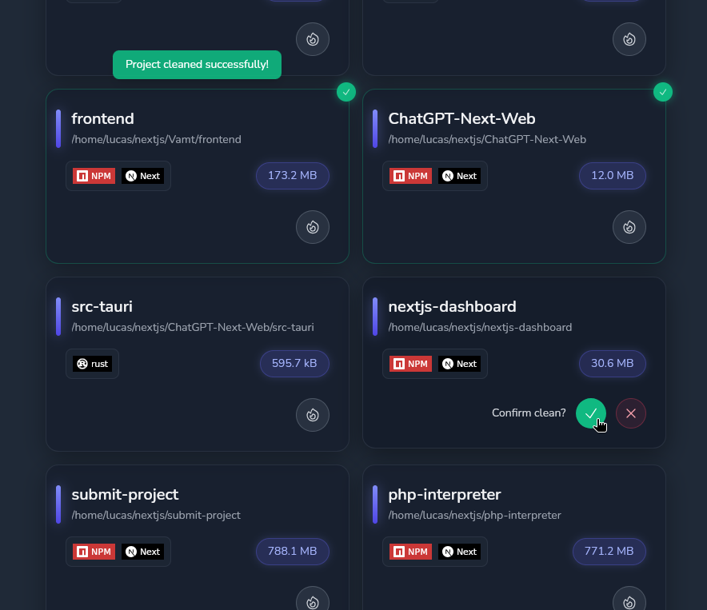

# Dcleaner

A Tauri app written in Rust + React (TS

## Goal

Practice Rust language and Tauri, build a GUI to clean projects dependencies/artifacts/cache folders.

## Recommended IDE Setup

- [VS Code](https://code.visualstudio.com/) + [Tauri](https://marketplace.visualstudio.com/items?itemName=tauri-apps.tauri-vscode) + [rust-analyzer](https://marketplace.visualstudio.com/items?itemName=rust-lang.rust-analyzer)

## Status

Currently, the app just explores the home directory.

Only dependencies are removed when cleaning.

## Roadmap

- Filter/paginate projects
- Customize folders to discover
- More details on projects (last modified, stats on size...)
- Multilingual
