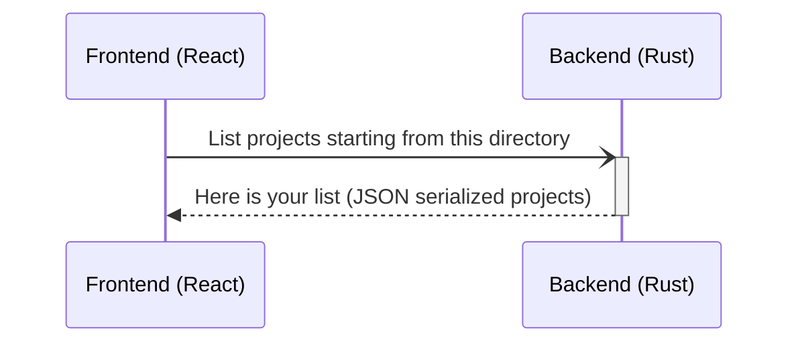
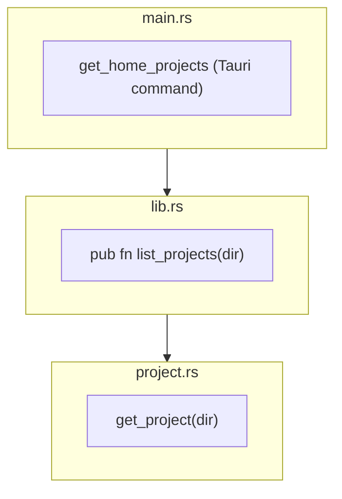

# Project analysis

Now that we've begun to read some directories, maybe we can move on to identify projects. The directories discovery may be improved after, I don't know, but I think we can start to design the `Project` part.

## Goal

The current goal is to be able to identify projects into a directory (right now the home folder), and also pass it properly to the frontend part.

In the future, "a directory" would become "directories" in general, I guess.

<div style={{ textAlign: "center" }}>



</div>

## The `Project` struct

Basically, we can have many different project types.

In general, we can probably say they will all have a `path` and a `size`, as well as some `dirs` we would like to get rid of.

Kondo actually has this interesting `ProjectSize` struct we could also use to have a more precise estimation of the size :

```rust
#[derive(Debug, Clone)]
pub struct ProjectSize {
    pub artifact_size: u64,
    pub non_artifact_size: u64,
    pub dirs: Vec<(String, u64, bool)>,
}
```

To start simple, let's create this `Project` struct, with only the path and the project type :

```rust
#[derive(Clone, Debug, serde::Serialize)]
pub struct Project {
    pub path: PathBuf,
    project_type: ProjectType,
}
```

So what we would like to return to the React part of the app would be a `Vec<Project>`. Let's try to build this.

## Discovering projects

Let's break down the workflow of projects discovery, starting from the Tauri command :

<div style={{ textAlign: "center" }}>



</div>

To get all the folders recursively, we can use the [ignore](https://docs.rs/ignore/latest/ignore/index.html) crate, as it is supposed to ignore folders found in `.gitignore` files.

There is an option to ignore them even if there isn't any `.git` folder inside the project, this can avoid having dozens of `node_modules` being included in the analysis :

```rust
let walker = ignore::WalkBuilder::new(folder_path)
  .require_git(false)
  .build();
```

## Inheritance ?

From an object-oriented approach, we could design some kind of `Project` _contract_ through the definition of an abstract class or an interface, and then have each kind of concrete `Project` implement this contract.

We would then end up with `NpmProject`, `CargoProject`, `ComposerProject`, etc...implementing the contract, for instance `getDependenciesFolder`, or `getVariants` for Composer to give us more hints about whether we may have a Symfony or a Laravel project, or npm telling us more about this Next or Gatsby or whatever other kind of library/framework it may use, etc...

Rust doesn't have inheritance, as it doesn't have objects. It has generics though, so maybe it could be worth it to explore a `Project<Composer>`, `Project<Npm>` approach...along with generic traits implementation.

But it looks like a _polymorphic_ behaviour can be achieved with [**trait objects**](https://doc.rust-lang.org/book/ch17-02-trait-objects.html).
